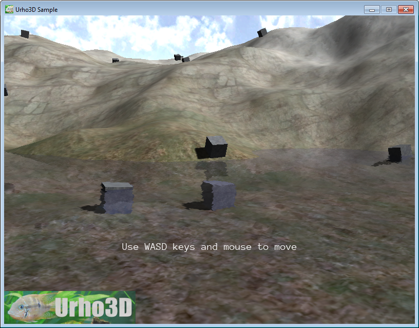

# Первые шаги

В данном уроке предполагается, что вы работаете в Windows.

## Необходимый софт

### Git

Git позволяет работать с репозиториями. На данном этапе нам интересно
только скачивание репозитория с исходниками движка.

Git для Windows можно скачать либо с <https://git-scm.com>, либо с <https://gitforwindows.org>.
Оба сайта перенаправят вас на один и тот же файл.

### CMake

Так как движок поддерживает разные операционные системы и компиляторы, то вместо
кучи конфигов для разных платформ имеется специальный "скрипт", который генерирует
файлы проектов для конкретно вашей операционной системы и компилятора.

Выполнением этого "скрипта" занимается программа CMake, которую можно скачать тут:
<https://cmake.org>.

### Visual Studio

После того как мы с помощью CMake создадим проекты для Visual Studio,
нам потребуется сама VS, чтобы эти проекты скомпилировать.
Скачать можно тут: <https://www.visualstudio.com>.

## Скачивание движка

Создайте и запустите bat-файл:

```
:: Меняем кодировку консоли на UTF-8
chcp 65001

:: Путь к git.exe
set "PATH=c:\program files\git\bin"

:: Качаем репозиторий в папку repo
git clone https://github.com/urho3d/Urho3D repo

:: Так как в движке могут произойти изменения, ломающую обратную совместимость,
:: то возвращаем состояние репозитория к определённой версии (29.11.2022)
git -C repo reset --hard f3217aecc88311b87c9746d65df4f7438170e9a1

:: Ждём нажатие Enter перед закрытием консоли
pause
```

## Создание проектов для Visual Studio

Создайте и запустите bat-файл:

```
:: Меняем кодировку консоли на UTF-8
chcp 65001

:: Указываем путь к cmake.exe
set "PATH=c:\programs\cmake\bin"

:: Создаём проекты для Visual Studio 2019 в папке build_vs, используя конфиг CMakeLists.txt из папки repo
cmake.exe repo -B build_vs -G "Visual Studio 16" -A x64 -D URHO3D_OPENGL=ON -D URHO3D_D3D11=ON

:: Ждём нажатие Enter перед закрытием консоли
pause
```

Опции CMake: <https://cmake.org/cmake/help/latest/manual/cmake.1.html#options>

* `-B build_vs` указывает папку, в которой будут созданы проекты
* `-G "Visual Studio 16" -A x64` указывает генератор (подробнее
  [тут](https://cmake.org/cmake/help/latest/manual/cmake-generators.7.html) и
  [тут](https://cmake.org/cmake/help/latest/generator/Visual%20Studio%2016%202019.html))
* `-D URHO3D_OPENGL=ON -D URHO3D_D3D11=ON` - это две переменные, которые передаются в "скрипт" CMake. В результате установки этих переменных
  игра будет поддерживать оба API (OpenGL и Direct3D 11)
  
## Компиляция проектов
  
Сгенерированные проекты можно открыть в VS и скомпилировать. А можно скомпилировать с помощью bat-файла:
  
```
:: Меняем кодировку консоли на UTF-8
chcp 65001

:: Указываем путь к cmake.exe
set "PATH=c:\programs\cmake\bin"

:: Компилируем проекты в папке build_vs
cmake --build build_vs --config Release

:: Ждём нажатие Enter перед закрытием консоли
pause
```

`--config Release` можно заменить на `--config Debug`, если нужна отладочная версия сборки.

## Посмотреть в действии

В папке `build_vs/bin` скомпилированные примеры. Возможности движка, которые они демонстрируют: создание 2D и 3D приложений, скелетная анимация, физика (Bullet и Box2D), работа с сетью, воспроизведение звуков, внутриигровой интерфейс, локализация и многое другое. Исходники этих примеров находятся в папке `repo/Source/Samples`.

Так как мы при генерации проектов указали, что нам нужны оба API, то каждый пример можно запустить с параметром `-opengl` или `-d3d11` для выбора нужного API. По умолчанию используется Direct3D 11. Во многих примерах есть DebugHud, который вызывается по F2. Внизу экрана вы сможете увидеть испольуземый API.

Большинство примеров помимо C++ продублированы на скриптовом языке AngelScript (не путать с ActionScript). Скрипты находятся в папке `Data/Scripts`. Для их запуска предназначен лаунчер `build_vs/bin/Urho3DPlayer.exe`.

Запуск примера в окне 800x600:

```
Urho3DPlayer.exe Data/Scripts/23_Water.as -x 800 -y 600 -w
```



Если запускать лаучнер без параметров, то в качестве аргументов командой строки используется содержимое файла Data/CommandLine.txt. Все параметры лаунчера можно посмотреть тут: <https://urho3d-doxygen.github.io/1_9_0_tutors/_running.html>.

## Привет, мир!

Создадим простое приложение на языке AngelScript. Несколько подготовительных шагов:

* В пустую папку скопируйте лаунчер Urho3DPlayer.exe и библиотеку d3dcompiler_47.dll (эта библиотека будет только если вы скомпилировали движок с поддержкой Direct3D 11)
* Переименуйте лаунчер, чтобы пользователь понимал, что именно его нужно запускать (например в game.exe)
* Сюда же скопируйте папку CoreData. Эта папка содержит необходимые для работы движка данные (шейдеры и прочее)
* Создайте папку Data. В ней будут содержаться ресурсы нашей игры
* В папке Data создайте папку для скриптов (например scripts) и в ней файл main.as, в котором и будет описана логика игры
* В папке Data создайте файл CommandLine.txt с содержимым `scripts/main.as`, чтобы лаунчер знал, что именно нужно запускать

Точкой входа скрипта является функция Start(). В файл main.as добавьте:

```
void Start()
{
}
```

Теперь запустите game.exe. Если вы всё сделали правильно, то вы должны увидеть черный экран. Закройте "игру" с помощью Alt+F4.

Сейчас я хочу немного рассказать об основной идее Urho3D. Сцены в движке являются иерархическими деревьями, состоящими из узлов/нод. Каждая нода имеет такие параметры как позиция в пространстве, угол поворота, масштаб. К любой ноде можно привязать так называемые компоненты: 3D-модели, спрайты, скрипты, источники звука, света и так далее, а также дочерние ноды, которые будут наследовать все трансформации.

Создадим сцену и камеру:

```
Scene@ scene_; // Указатель на сцену

void Start()
{
    // Создаём новую сцену
    scene_ = Scene();

    // Сцена является производым от ноды типом и к ней тоже
    // можно добавлять компоненты. Компонент Octree (октодерево)
    // необходим, если вы планируете отображать объекты сцены,
    // то есть почти всегда
    scene_.CreateComponent("Octree");

    // Создаём для сцены дочернюю ноду и задаем ей имя MyCamera.
    // Имена нод можно использовать для того, чтобы искать нужный узел сцены
    Node@ cameraNode = scene_.CreateChild("MyCamera");

    // Создаём камеру и прикрепляем ее к узлу
    cameraNode.CreateComponent("Camera");

    // Указываем для узла с камерой положение в пространстве.
    // Координата X направлена слева направо, Y - снизу вверх, Z - от вас вглубь экрана
    cameraNode.position = Vector3(0.0f, 0.0f, -5.0f);

    // Указываем движку какая камера какой сцены будет показываться на экране
    Viewport@ viewport = Viewport(scene_, cameraNode.GetComponent("Camera"));
    renderer.viewports[0] = viewport;
}
```

Экран всё ещё черный, поэтому давайте добавим что-нибудь в сцену. Для этого нам понадобится какая-нибудь модель. В папке `Data` создайте папку `models` и скопируйте в нее `Box.mdl` из `repo\bin\Data\Models`. Загрузим модель:

```
void Start()
{
    ...
    // Создаём ноду для 3D-модели
    Node@ boxNode = scene_.CreateChild("MyBox");

    // Создаём компонент StaticModel - простая 3D-модель без скелета
    StaticModel@ boxObject = boxNode.CreateComponent("StaticModel");

    // Загружаем модель из файла.
    // Если эта модель уже была загружена ранее, то она не будет загружаться повторно
    boxObject.model = cache.GetResource("Model", "models/Box.mdl");

    // Повернём узел с кубом (все значения указываются в градусах)
    boxNode.rotation = Quaternion(45.0f, 45.0f, 45.0f);
}
```

Теперь на экран выводится куб, но он плохо виден, потому что освещен только стандартным фоновым освещением. Давайте добавим в сцену источник света:

```
void Start()
{
    ...
    // Создаем ноду для источника света
    Node@ lightNode = scene_.CreateChild("MyLight");

    // Создаем источник света и прикрепляем к ноде
    Light@ light = lightNode.CreateComponent("Light");

    // Указываем тип источника света - солнечный свет
    light.lightType = LIGHT_DIRECTIONAL;

    // Указываем направление света
    lightNode.direction = Vector3(0.6f, -0.6f, 0.8f);
}
```

И, наконец, давайте заставим наш куб вращаться:

```
void Start()
{
    ...
    // Определяем функцию, которая будет вызываться каждый кадр
    SubscribeToEvent("Update", "HandleUpdate");
}

// Обработчик события Update
void HandleUpdate(StringHash eventType, VariantMap& eventData)
{
    // Сколько времени прошло с предыдущего кадра
    float time_step = eventData["TimeStep"].GetFloat();

    // Находим ноду с нашим кубом
    Node@ boxNode = scene_.GetChild("MyBox");

    // Поворачиваем её
    boxNode.Rotate(Quaternion(10.0f * time_step, 10.0f * time_step, 10.0f * time_step));
}
```

Если что-то пошло не так, то возможно в лог было выведено сообщение об ошибке: `c:\Users\ИМЯ_ПОЛЬЗОВАТЕЛЯ\AppData\Roaming\urho3d\logs\main.as.log`.

## Публикация игры

Допустим, мы хотим продать нашу замечательную игру, но не хотим, чтобы кто-то копался в её исходниках. Воспользуемся утилитой `ScriptCompiler.exe`, которая находится в папке `build_vs\bin\tool`:

```
ScriptCompiler.exe Data/scripts/main.as
```

На выходе получаем main.asc. Исходный файл main.as убираем подальше. При отсутствии запрашиваемого .as файла загружается .asc файл, а значит не нужно исправлять `CommandLine.txt`. Дополнительным плюсом этого является более быстрый запуск игры.

Итоговый результат находится тут же в репозитории.

---

*Следующий урок: [Редактор Urho3D](https://github.com/urho3d-learn/editor).*

*Старая версия урока: <https://github.com/1vanK/Urho3DHabrahabr01>.*
